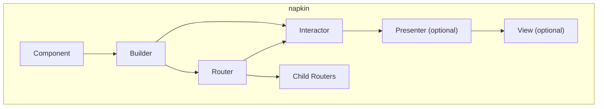

# napkin

### Now Supporting ***SwiftUI***


[](https://swiftpackageindex.com/WikipediaBrown/napkin)
[](https://swiftpackageindex.com/WikipediaBrown/napkin)

napkin is a reimagining of Uber's [RIBs](https://github.com/uber/RIBs) with RxSwift replaced by Combine. It provides a robust architecture for building scalable iOS applications using the Router-Interactor-Builder pattern.

## Table of Contents

- [Supported Platforms](#supported-platforms)
- [Installation](#-installation)
- [Architecture Overview](#architecture-overview)
- [Core Components](#core-components)
  - [Interactor](#interactor)
  - [Router](#router)
  - [Builder](#builder)
  - [Component & Dependency](#component--dependency)
  - [Presenter (Optional)](#presenter-optional)
  - [View (Optional)](#view-optional)
- [Usage Examples](#-usage-examples)
  - [Creating a Basic napkin](#creating-a-basic-napkin)
  - [Parent-Child Communication](#parent-child-communication)
  - [SwiftUI Integration](#swiftui-integration)
  - [UIKit Integration](#uikit-integration)
- [Best Practices](#-best-practices)
- [Tooling](#-tooling)
- [Testing](#-testing)
- [Versioning](#-versioning)
- [Contributing](#-contributing)
- [Author](#-author)
- [License](#-license)

## Supported Platforms

napkin supports Apple platforms only:
- iOS 13.0+
- macOS (via Mac Catalyst)

## 🛠️ Installation

**napkin** can be installed with Swift Package Manager.

### Swift Package Manager (Xcode 12 or higher)

The preferred way of installing **napkin** is via the [Swift Package Manager](https://swift.org/package-manager/).

1. In Xcode, open your project and navigate to **File** → **Swift Packages** → **Add Package Dependency...**
2. Paste the repository URL (`https://github.com/WikipediaBrown/napkin.git`) and click **Next**.
3. For **Rules**, select **Version (Up to Next Major)** and click **Next**.
4. Click **Finish**.

[Adding Package Dependencies to Your App](https://developer.apple.com/documentation/swift_packages/adding_package_dependencies_to_your_app)

## Architecture Overview

napkin implements the RIB (Router-Interactor-Builder) architecture pattern, which structures your app as a tree of modular units called "napkins." Each napkin encapsulates a specific feature or screen and consists of:



**Key Principles:**
- **Unidirectional data flow**: Data flows down through the tree, events flow up
- **Single responsibility**: Each component has a clear, focused purpose
- **Testability**: Business logic is isolated in Interactors, making unit testing straightforward
- **Scalability**: Large teams can work on different napkins independently

## Core Components

### Interactor

The **Interactor** is the brain of a napkin. It contains all business logic and manages the napkin's state. Interactors have a lifecycle driven by their parent Router.

**Purpose:**
- Contains business logic
- Manages state
- Communicates with services and data layers
- Responds to user actions (via listener protocols)

**Lifecycle:**
- `didBecomeActive()` - Called when the napkin is attached to its parent
- `willResignActive()` - Called when the napkin is about to be detached

```swift
// Define a listener protocol for parent communication
protocol MyListener: AnyObject {
    func didComplete(with result: String)
}

class MyInteractor: Interactor {

    weak var listener: MyListener?
    weak var router: MyRouting?

    private let myService: MyServiceProtocol
    private var cancellables = Set<AnyCancellable>()

    init(myService: MyServiceProtocol) {
        self.myService = myService
        super.init()
    }

    override func didBecomeActive() {
        super.didBecomeActive()
        // Subscribe to data streams
        myService.dataPublisher
            .sink { [weak self] data in
                self?.handleData(data)
            }
            .store(in: &cancellables)
    }

    override func willResignActive() {
        super.willResignActive()
        // Cancel subscriptions automatically via cancellables
        cancellables.removeAll()
    }

    // MARK: - Business Logic

    func userDidTapButton() {
        myService.performAction()
            .sink { [weak self] result in
                self?.listener?.didComplete(with: result)
            }
            .store(in: &cancellables)
    }

    private func handleData(_ data: MyData) {
        // Process data and update state
    }
}
```

### Router

The **Router** manages the napkin tree structure. It handles attaching and detaching child napkins and coordinates navigation.

**Purpose:**
- Owns and drives the Interactor's lifecycle
- Manages child napkins (attach/detach)
- Handles navigation logic
- Optionally owns a view controller

**Key Methods:**
- `didLoad()` - Called once when the router is first loaded
- `attachChild(_:)` - Attaches a child router
- `detachChild(_:)` - Detaches a child router

```swift
// Define a routing protocol for the Interactor to use
protocol MyRouting: AnyObject {
    func routeToDetails(with id: String)
    func routeBackFromDetails()
}

class MyRouter: Router<MyInteractor>, MyRouting {

    private let detailsBuilder: DetailsBuilding
    private var detailsRouter: DetailsRouting?

    init(interactor: MyInteractor, detailsBuilder: DetailsBuilding) {
        self.detailsBuilder = detailsBuilder
        super.init(interactor: interactor)
        interactor.router = self
    }

    override func didLoad() {
        super.didLoad()
        // Attach any permanent child napkins here
    }

    // MARK: - MyRouting

    func routeToDetails(with id: String) {
        // Only attach if not already attached
        guard detailsRouter == nil else { return }

        let router = detailsBuilder.build(withListener: interactor, id: id)
        detailsRouter = router
        attachChild(router)
    }

    func routeBackFromDetails() {
        guard let router = detailsRouter else { return }
        detachChild(router)
        detailsRouter = nil
    }
}
```

### Builder

The **Builder** is responsible for constructing a napkin and wiring up all its dependencies. It's the factory for creating napkin instances.

**Purpose:**
- Creates and assembles napkin components
- Wires up dependencies via the Component
- Returns a Router that represents the napkin

```swift
// Define what this builder needs from its parent
protocol MyDependency: Dependency {
    var analyticsService: AnalyticsServiceProtocol { get }
}

// Define the build interface
protocol MyBuilding {
    func build(withListener listener: MyListener) -> MyRouting
}

final class MyBuilder: Builder<MyDependency>, MyBuilding {

    func build(withListener listener: MyListener) -> MyRouting {
        let component = MyComponent(dependency: dependency)
        let interactor = MyInteractor(myService: component.myService)
        interactor.listener = listener

        let detailsBuilder = DetailsBuilder(dependency: component)

        return MyRouter(
            interactor: interactor,
            detailsBuilder: detailsBuilder
        )
    }
}
```

### Component & Dependency

**Components** provide dependency injection within a napkin tree. They define what dependencies a napkin provides to its children.

**Dependency** is a protocol that defines what a napkin requires from its parent.

**Purpose:**
- Manages dependency injection
- Provides shared instances within a scope
- Connects parent and child dependencies

```swift
// What this napkin requires from its parent
protocol MyDependency: Dependency {
    var analyticsService: AnalyticsServiceProtocol { get }
    var userSession: UserSession { get }
}

// What this napkin provides to its children
protocol MyChildDependency: Dependency {
    var myService: MyServiceProtocol { get }
    var analyticsService: AnalyticsServiceProtocol { get }
}

final class MyComponent: Component<MyDependency>, MyChildDependency {

    // Pass through from parent
    var analyticsService: AnalyticsServiceProtocol {
        return dependency.analyticsService
    }

    // Create a new shared instance for this scope
    var myService: MyServiceProtocol {
        return shared { MyService(session: dependency.userSession) }
    }

    // Create a new instance each time (not shared)
    var viewModel: MyViewModel {
        return MyViewModel(service: myService)
    }
}

// For the root napkin with no parent dependencies
final class RootComponent: Component<EmptyDependency>, MyDependency {

    var analyticsService: AnalyticsServiceProtocol {
        return shared { AnalyticsService() }
    }

    var userSession: UserSession {
        return shared { UserSession() }
    }
}
```

### Presenter (Optional)

The **Presenter** transforms business data into view-friendly formats. Use it when you need complex data transformation between the Interactor and View.

**Purpose:**
- Transforms business models to view models
- Keeps Interactor focused on business logic
- Keeps View focused on display

```swift
protocol MyPresentable: AnyObject {
    func present(items: [Item])
    func presentError(_ error: Error)
}

protocol MyPresentableListener: AnyObject {
    func didSelectItem(at index: Int)
}

class MyPresenter: MyPresentable {

    weak var view: MyViewControllable?

    func present(items: [Item]) {
        let viewModels = items.map { item in
            ItemViewModel(
                title: item.name.uppercased(),
                subtitle: formatDate(item.date),
                imageURL: item.thumbnailURL
            )
        }
        view?.display(viewModels: viewModels)
    }

    func presentError(_ error: Error) {
        let message = ErrorMessageFormatter.format(error)
        view?.displayError(message: message)
    }

    private func formatDate(_ date: Date) -> String {
        // Format date for display
    }
}
```

### View (Optional)

The **View** layer handles UI rendering. napkin supports both UIKit and SwiftUI.

**Purpose:**
- Renders UI
- Captures user interactions
- Forwards events to the Interactor (via listener)

## 👩🏽‍💻 Usage Examples

### Creating a Basic napkin

Here's a complete example of a simple napkin:

```swift
// MARK: - Dependency

protocol ProfileDependency: Dependency {
    var userService: UserServiceProtocol { get }
}

// MARK: - Component

final class ProfileComponent: Component<ProfileDependency> {

    var userService: UserServiceProtocol {
        return dependency.userService
    }
}

// MARK: - Interactor

protocol ProfileListener: AnyObject {
    func profileDidRequestLogout()
}

final class ProfileInteractor: Interactor {

    weak var listener: ProfileListener?
    weak var router: ProfileRouting?

    private let userService: UserServiceProtocol

    init(userService: UserServiceProtocol) {
        self.userService = userService
        super.init()
    }

    func logoutTapped() {
        userService.logout()
        listener?.profileDidRequestLogout()
    }
}

// MARK: - Router

protocol ProfileRouting: AnyObject {
    // Define routing methods
}

final class ProfileRouter: Router<ProfileInteractor>, ProfileRouting {

    override func didLoad() {
        super.didLoad()
    }
}

// MARK: - Builder

protocol ProfileBuilding {
    func build(withListener listener: ProfileListener) -> ProfileRouting
}

final class ProfileBuilder: Builder<ProfileDependency>, ProfileBuilding {

    func build(withListener listener: ProfileListener) -> ProfileRouting {
        let component = ProfileComponent(dependency: dependency)
        let interactor = ProfileInteractor(userService: component.userService)
        interactor.listener = listener
        return ProfileRouter(interactor: interactor)
    }
}
```

### Parent-Child Communication

napkins communicate via listener protocols (child to parent) and method calls (parent to child):

```swift
// Child notifies parent via listener
protocol ChildListener: AnyObject {
    func childDidFinish(with result: Result)
}

// Parent implements the listener
extension ParentInteractor: ChildListener {
    func childDidFinish(with result: Result) {
        // Handle result from child
        processResult(result)
        router?.detachChild()
    }
}

// Parent tells router to attach child
func showChild() {
    router?.routeToChild()
}
```

### SwiftUI Integration

Use `ViewableRouter` with a hosting controller for SwiftUI views:

```swift
// MARK: - SwiftUI View

struct MySwiftUIView: View {
    @ObservedObject var viewModel: MyViewModel
    let listener: MyViewListener

    var body: some View {
        VStack {
            Text(viewModel.title)
            Button("Action") {
                listener.didTapAction()
            }
        }
    }
}

// MARK: - HostingController

protocol MyViewControllable: ViewControllable {}

final class MyHostingController: UIHostingController<MySwiftUIView>, MyViewControllable {

    init(viewModel: MyViewModel, listener: MyViewListener) {
        let view = MySwiftUIView(viewModel: viewModel, listener: listener)
        super.init(rootView: view)
    }

    @MainActor required dynamic init?(coder aDecoder: NSCoder) {
        fatalError("init(coder:) has not been implemented")
    }
}

// MARK: - Router

final class MyRouter: ViewableRouter<MyInteractor, MyViewControllable> {

    override func didLoad() {
        super.didLoad()
    }
}

// MARK: - Builder

final class MyBuilder: Builder<MyDependency>, MyBuilding {

    func build(withListener listener: MyListener) -> MyRouting {
        let component = MyComponent(dependency: dependency)
        let viewModel = component.viewModel
        let interactor = MyInteractor()
        interactor.listener = listener

        let viewController = MyHostingController(
            viewModel: viewModel,
            listener: interactor
        )

        return MyRouter(interactor: interactor, viewController: viewController)
    }
}
```

### UIKit Integration

For UIKit, create a standard view controller:

```swift
protocol MyViewControllable: ViewControllable {
    func display(items: [ItemViewModel])
}

final class MyViewController: UIViewController, MyViewControllable {

    weak var listener: MyViewListener?

    private let tableView = UITableView()
    private var items: [ItemViewModel] = []

    override func viewDidLoad() {
        super.viewDidLoad()
        setupUI()
    }

    func display(items: [ItemViewModel]) {
        self.items = items
        tableView.reloadData()
    }

    private func setupUI() {
        // Setup table view, constraints, etc.
    }
}

extension MyViewController: UITableViewDelegate {
    func tableView(_ tableView: UITableView, didSelectRowAt indexPath: IndexPath) {
        listener?.didSelectItem(at: indexPath.row)
    }
}
```

## 🎯 Best Practices

### 1. Keep Interactors Focused
- Interactors should only contain business logic
- Don't import UIKit in Interactors
- Use protocols to communicate with Routers and Views

### 2. Use Protocols for Testability
```swift
// Good: Protocol-based dependency
protocol MyServiceProtocol {
    func fetchData() -> AnyPublisher<Data, Error>
}

class MyInteractor {
    private let service: MyServiceProtocol  // Easy to mock
}

// Bad: Concrete dependency
class MyInteractor {
    private let service = MyService()  // Hard to test
}
```

### 3. Manage Subscriptions Properly
```swift
class MyInteractor: Interactor {
    private var cancellables = Set<AnyCancellable>()

    override func didBecomeActive() {
        super.didBecomeActive()
        // Setup subscriptions here
    }

    override func willResignActive() {
        super.willResignActive()
        cancellables.removeAll()  // Clean up
    }
}
```

### 4. Use `shared` for Expensive Dependencies
```swift
class MyComponent: Component<MyDependency> {
    // Shared: Same instance reused
    var database: Database {
        return shared { Database() }
    }

    // Not shared: New instance each time
    var viewModel: ViewModel {
        return ViewModel(database: database)
    }
}
```

### 5. Guard Against Double Attachment
```swift
func routeToChild() {
    guard childRouter == nil else { return }  // Prevent double attach
    let router = childBuilder.build(withListener: interactor)
    childRouter = router
    attachChild(router)
}
```

### 6. Clean Up When Detaching
```swift
func routeBackFromChild() {
    guard let router = childRouter else { return }
    detachChild(router)
    childRouter = nil  // Clear the reference
}
```

### 7. Use Weak References for Listeners
```swift
class MyInteractor: Interactor {
    weak var listener: MyListener?  // Always weak to avoid retain cycles
    weak var router: MyRouting?     // Always weak
}
```

### 8. Name Protocols Consistently
- `*Dependency` - What a napkin requires from parent
- `*Listener` - How child communicates to parent
- `*Routing` - Router's public interface
- `*Building` - Builder's public interface
- `*ViewControllable` - View controller's public interface

## 🪛 Tooling

### Xcode Templates

**napkin** comes with templates that let you add all components of a napkin (Builder, Interactor, Router & optional ViewController) straight from the `New > File..` menu.

#### Install Templates

```bash
git clone https://github.com/WikipediaBrown/napkin.git
bash napkin/Tools/InstallXcodeTemplates.sh
```

#### Available Templates
- **napkin** - Creates a complete napkin (Builder, Interactor, Router)
- **Launch napkin** - Creates a root napkin for app launch
- **napkin Unit Tests** - Creates test files for a napkin
- **Component Extension** - Creates a component extension for child dependencies
- **Service Manager** - Creates a service manager pattern

## 🧪 Testing

Run `Command+U` in Xcode to run the unit tests. Tests run automatically for all pull requests.

### Writing Tests

```swift
import XCTest
@testable import YourApp

final class MyInteractorTests: XCTestCase {

    private var interactor: MyInteractor!
    private var listener: MockMyListener!
    private var service: MockMyService!

    override func setUp() {
        super.setUp()
        listener = MockMyListener()
        service = MockMyService()
        interactor = MyInteractor(service: service)
        interactor.listener = listener
    }

    func testDidTapButton_callsService() {
        interactor.activate()

        interactor.didTapButton()

        XCTAssertTrue(service.performActionCalled)
    }

    func testServiceReturnsResult_notifiesListener() {
        interactor.activate()
        service.resultToReturn = "success"

        interactor.didTapButton()

        XCTAssertEqual(listener.lastResult, "success")
    }
}

// MARK: - Mocks

final class MockMyListener: MyListener {
    var lastResult: String?

    func didComplete(with result: String) {
        lastResult = result
    }
}

final class MockMyService: MyServiceProtocol {
    var performActionCalled = false
    var resultToReturn: String = ""

    func performAction() -> AnyPublisher<String, Never> {
        performActionCalled = true
        return Just(resultToReturn).eraseToAnyPublisher()
    }
}
```

### Fastlane

Run tests using fastlane:

```bash
cd napkin
bundle install
bundle exec fastlane unit_test
```

## 🐁 Versioning

**napkin** releases a [new version on GitHub](https://github.com/WikipediaBrown/napkin/releases) automatically when a pull request is approved from the `develop` branch to the `main` branch.

## 👩🏽‍💻 Contributing

Send a pull request or create an issue.

**Requirements:**
- Sign your commits:
  ```bash
  git config commit.gpgsign true
  ```

## ✍🏽 Author

Wikipedia Brown

## 🪪 License

**napkin** is available under the Apache 2.0 license. See the LICENSE file for more info.

<p align="center">Made with 🌲🌲🌲 in Cascadia</p>
