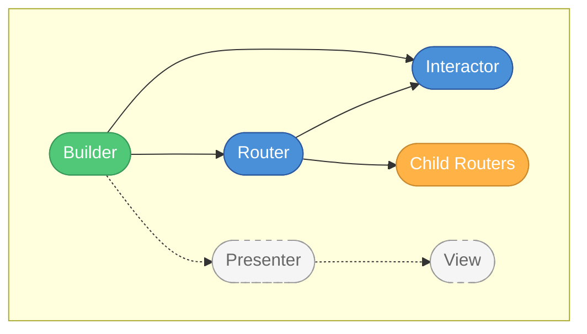
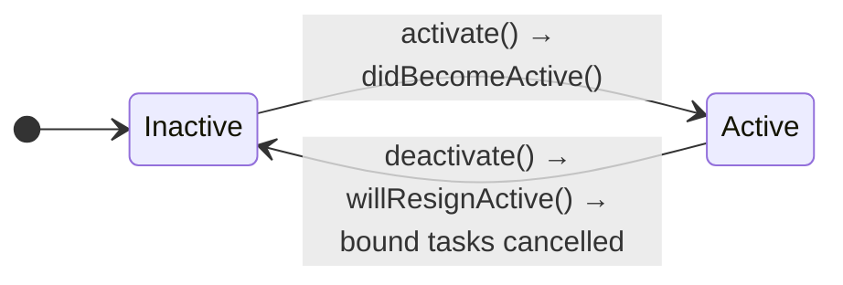
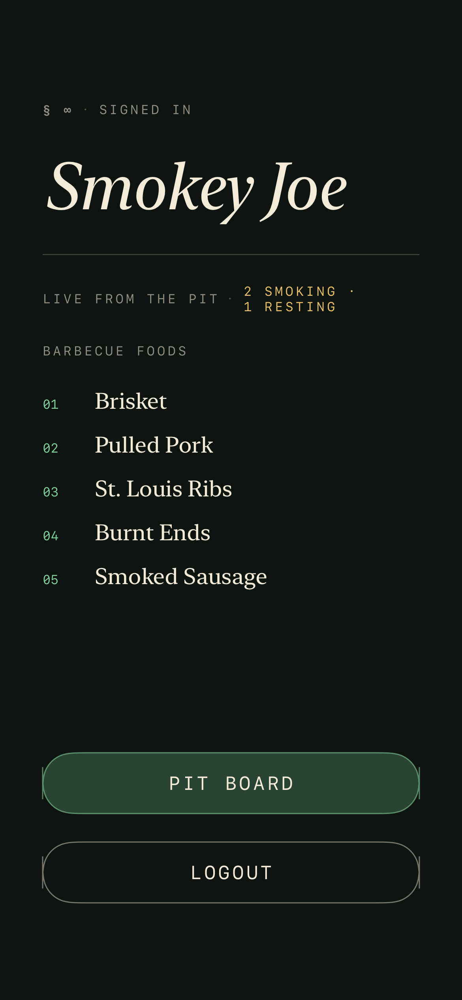
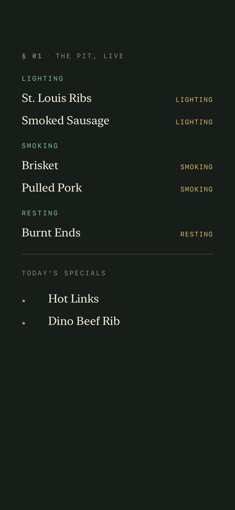

<p align="center">
  
</p>

# napkin

[](https://github.com/WikipediaBrown/napkin/actions/workflows/Tests.yml)
[](https://github.com/WikipediaBrown/napkin/actions/workflows/Release.yml)
[](https://github.com/WikipediaBrown/napkin/releases/latest)
[](https://swiftpackageindex.com/WikipediaBrown/napkin)
[](https://swiftpackageindex.com/WikipediaBrown/napkin)
[](https://github.com/WikipediaBrown/napkin/blob/main/LICENSE.md)
[](https://getnapkin.to/documentation/napkin/)
[](https://deepwiki.com/WikipediaBrown/napkin)

napkin is a fork of Uber's [RIBs](https://github.com/uber/ribs-ios) rebuilt on Swift 6.2 native concurrency. It structures iOS and macOS applications as a tree of modular units using the Router-Interactor-Builder pattern, with business logic running off the main actor and routing/presentation pinned to it.

## Table of Contents

- [Supported Platforms](#supported-platforms)
- [Installation](#installation)
- [Architecture Overview](#architecture-overview)
- [Concurrency Model](#concurrency-model)
- [Core Components](#core-components)
  - [Builder](#builder)
  - [Component & Dependency](#component--dependency)
  - [Interactor](#interactor)
  - [Interactor Lifecycle](#interactor-lifecycle)
  - [Router](#router)
  - [Presenter (Optional)](#presenter-optional)
  - [ViewControllable](#viewcontrollable)
- [Routing & Navigation](#routing--navigation)
- [Streaming State Down the Tree](#streaming-state-down-the-tree)
- [Launching the App](#launching-the-app)
- [SwiftUI Integration](#swiftui-integration)
- [Testing](#testing)
- [Tooling](#tooling)
- [Versioning](#versioning)
- [Contributing](#contributing)
- [Author](#author)
- [License](#license)

## Supported Platforms

- iOS 26.0+
- macOS 26.0+

These are deliberate support targets, not the hard compiler minimum. napkin's sources type-check down to iOS 18 / macOS 15 (bounded by `Mutex` from the `Synchronization` module). The project intentionally tracks only the current OS generation so the actor model and `isolated deinit`-based teardown (SE-0371, Swift 6.2) run on a single current Swift runtime instead of a back-deployment matrix.

## Installation

Add napkin via [Swift Package Manager](https://swift.org/package-manager/):

1. In Xcode, navigate to **File** > **Add Package Dependencies...**
2. Paste the repository URL: `https://github.com/WikipediaBrown/napkin.git`
3. Click **Add Package**.

> **Xcode 26 — Default Actor Isolation.** Xcode 26's App template sets the **Default Actor Isolation** build setting to `MainActor`. napkin's `Builder` and `Component` are deliberately `nonisolated` (DI plumbing, off any actor), so in a `MainActor`-default module a `Builder`/`Component` subclass will fail to compile with *"Main actor-isolated initializer 'init(dependency:)' has different actor isolation from nonisolated overridden declaration."* Mark each `Builder`/`Component` subclass `nonisolated` (the bundled Xcode templates already do — see the snippets below), or set the target's **Default Actor Isolation** to `nonisolated`. Routers and view controllers stay `@MainActor`; interactors stay `actor`s. Full explanation in [Getting Started](https://getnapkin.to/documentation/napkin/gettingstarted).

## Architecture Overview

napkin structures your app as a tree of units called "napkins." Each napkin encapsulates a feature and consists of:


```mermaid
flowchart LR
    subgraph napkin[" "]
        direction LR
        B([Builder]):::builder --> R([Router]):::core
        B --> I([Interactor]):::core
        B -.-> P([Presenter]):::optional
        R --> I
        R --> C([Child Routers]):::children
        P -.-> V([View]):::optional
    end

    classDef core fill:#4a90d9,stroke:#2c5aa0,color:#fff
    classDef builder fill:#50c878,stroke:#3a9a5c,color:#fff
    classDef optional fill:#f5f5f5,stroke:#999,color:#666,stroke-dasharray: 5 5
    classDef children fill:#ffb347,stroke:#cc8a2e,color:#fff
```

| Component | Required | Role |
|-----------|----------|------|
| **Builder** | Yes | Constructs the napkin, wires dependencies |
| **Component** | Yes | Provides dependencies to this napkin and its children |
| **Interactor** | Yes | Business logic, state management, lifecycle |
| **Router** | Yes | Manages the napkin tree (attach/detach children) |
| **Presenter** | No | Transforms business data into view-friendly formats |
| **View** | No | UIKit view controller or SwiftUI hosting controller |

Data flows down the tree. Events flow up via listener protocols. For values that keep changing after a child is built, see [Streaming State Down the Tree](#streaming-state-down-the-tree).

## Concurrency Model

napkin uses Swift 6.2 native concurrency. Business logic in the Interactor runs **off the main actor by construction**; routing and presentation run on the main actor.

| Layer | Isolation |
|-------|-----------|
| `Interactable` (protocol) + per-feature `final actor` | `actor` |
| `InteractorLifecycle` (helper) | `final class @unchecked Sendable` (Mutex-protected) |
| `Router` / `ViewableRouter` / `LaunchRouter` | `@MainActor` |
| `Presenter` (`@Observable`) | `@MainActor` |
| `ViewControllable` | `@MainActor` |
| `Builder` / `Component` | non-isolated, `Sendable` |

Crossings between layers are explicit `await` points:

- Interactor → Router: `await router?.routeToProfile()`
- Interactor → Presenter: `await presenter.presentUser(user)`
- View → Interactor (events): `dispatch { await listener?.didTapLogout() }`

Combine has been removed. View-state changes flow through `@Observable` properties on the Presenter; lifecycle-bound subscriptions use `task { for await … }` over a service's `AsyncStream` or an `Observations` sequence — recipes in [Streaming State Down the Tree](#streaming-state-down-the-tree).

### Why protocol composition instead of class inheritance?

Swift actors do not support inheritance (SE-0306). Rather than fall back to `@MainActor open class` (which would pin business logic to the main actor) or a custom `@globalActor` (which would serialize all interactors on one executor), napkin uses **protocol composition**: each feature's interactor is its own `final actor` conforming to `Interactable`. The `InteractorLifecycle` class — the only `@unchecked Sendable` type in the framework — owns the mutex-protected lifecycle state and its concurrency contract. Default implementations of `activate` / `deactivate` / `task(_:)` / `isActive` / `isActiveStream` come from a protocol extension that delegates to `lifecycle`.

### Divergence from Uber RIBs-iOS

Uber's `RIBs-iOS` PR #49 unifies the framework on `@MainActor` (Interactor included). napkin deliberately keeps the Interactor off the main actor so business logic is not pinned to the main thread. The cost is `await` at every cross-layer call; the benefit is enforced clean-architecture isolation.

Both frameworks agree the *view-facing* seam belongs on `@MainActor`. napkin's base `Presentable` protocol is annotated `@MainActor`, so every feature's presentable (and any `var listener` it requires) inherits that isolation. The Swift 6 conformance error a RIB-shaped listener seam otherwise hits — *"Main actor-isolated property 'listener' cannot be used to satisfy nonisolated protocol requirement"* ([RIBs-iOS #43](https://github.com/uber/ribs-ios/issues/43)) — is therefore structurally impossible in napkin: the requirement and its `@MainActor` view-controller witness are always in the same isolation domain. The child-to-parent listener is a separate seam (an actor-isolated `weak var` behind a `Sendable async` protocol) and never had the problem. Full write-up: [The Swift 6 @MainActor listener-conformance error](https://getnapkin.to/blog/swift-6-mainactor-protocol-conformance/).

## Core Components

### Builder

The **Builder** constructs a napkin and wires its dependencies. It receives a `Dependency` from its parent and returns a `Router`. `Builder` is `Sendable` and non-isolated.

When the napkin has a view, mark `build()` as `@MainActor async` — `@MainActor` because `UIViewController` initialization requires the main actor; `async` because wiring the actor-based interactor (e.g. setting the listener and router) requires `await`:

```swift
protocol HomeDependency: Dependency {
    var userService: UserServiceProtocol { get }
}

protocol HomeBuildable: Buildable {
    @MainActor func build(withListener listener: HomeListener) async -> HomeRouting
}

nonisolated final class HomeBuilder: Builder<HomeDependency>, HomeBuildable {

    @MainActor
    func build(withListener listener: HomeListener) async -> HomeRouting {
        let component = HomeComponent(dependency: dependency)
        let viewController = HomeViewController()
        let interactor = HomeInteractor(
            presenter: viewController,
            userService: component.userService
        )
        let router = HomeRouter(interactor: interactor, viewController: viewController)
        await interactor.wire(router: router, listener: listener)
        return router
    }
}
```

For napkins without views, `build()` does not need `@MainActor`:

```swift
protocol AnalyticsBuildable: Buildable {
    func build(withListener listener: AnalyticsListener) async -> AnalyticsRouting
}
```

### Component & Dependency

A **Dependency** protocol declares what a napkin requires from its parent. A **Component** provides those dependencies and can create new ones for its children.

Use `shared {}` to create a single instance per component scope. Without `shared`, a new instance is created on each access. The `shared()` method is thread-safe.

```swift
protocol HomeDependency: Dependency {
    var analyticsService: AnalyticsServiceProtocol { get }
    var userSession: UserSession { get }
}

nonisolated final class HomeComponent: Component<HomeDependency> {

    // Passed through from parent
    var analyticsService: AnalyticsServiceProtocol {
        dependency.analyticsService
    }

    // Created once, shared within this scope
    var userService: UserServiceProtocol {
        shared { UserService(session: dependency.userSession) }
    }

    // New instance each time
    var viewModel: HomeViewModel {
        HomeViewModel(service: userService)
    }
}
```

The root napkin uses `EmptyDependency`:

```swift
nonisolated final class AppComponent: Component<EmptyDependency>, HomeDependency {
    var analyticsService: AnalyticsServiceProtocol {
        shared { AnalyticsService() }
    }
    var userSession: UserSession {
        shared { UserSession() }
    }
}
```

### Interactor

The **Interactor** contains all business logic. It is a `final actor` conforming to `Interactable` (or `PresentableInteractable` when paired with a view), and holds an `InteractorLifecycle` helper. Lifecycle is driven by its parent router: `didBecomeActive()` when attached, `willResignActive()` when detached. Both are `async`.

Interactors communicate:
- **Up** to parent napkins via `weak var listener` (a `Sendable` protocol the parent implements)
- **Down** to navigation via `weak var router` (an `@MainActor` routing protocol the router implements)

Listener and routing methods are `async` because they cross isolation boundaries.

```swift
protocol HomeListener: AnyObject, Sendable {
    func homeDidRequestLogout() async
}

@MainActor
protocol HomeRouting: ViewableRouting, Sendable {
    func routeToProfile() async
}

protocol HomePresentable: Presentable, Sendable {
    @MainActor var listener: HomePresentableListener? { get set }
    func presentUser(_ user: User) async
}

final actor HomeInteractor: PresentableInteractable, HomePresentableListener {

    nonisolated let lifecycle = InteractorLifecycle()
    nonisolated let presenter: HomePresentable

    weak var router: HomeRouting?
    weak var listener: HomeListener?

    private let userService: UserServiceProtocol

    init(presenter: HomePresentable, userService: UserServiceProtocol) {
        self.presenter = presenter
        self.userService = userService
    }

    func wire(router: HomeRouting?, listener: HomeListener?) {
        self.router = router
        self.listener = listener
    }

    func didBecomeActive() async {
        // Lifecycle-bound subscription: cancelled automatically on willResignActive.
        task {
            for await user in await self.userService.userStream() {
                await self.presenter.presentUser(user)
            }
        }
    }

    func willResignActive() async {
        // Tasks started via `task { }` are cancelled automatically here.
    }

    // MARK: - HomePresentableListener

    func didTapProfile() async {
        await router?.routeToProfile()
    }

    func didTapLogout() async {
        await listener?.homeDidRequestLogout()
    }
}
```

`didBecomeActive` / `willResignActive` are protocol default-implementation methods, so there is no `override` and no `super` call. Subscriptions started with `task { }` on the lifecycle are cancelled automatically when the interactor deactivates. The service side of `userStream()` — and every other Combine-replacement recipe — is in [Streaming State Down the Tree](#streaming-state-down-the-tree).

Use `PresentableInteractable` when the interactor communicates with a view through a presentable protocol. Use plain `Interactable` for napkins without views.

### Interactor Lifecycle

An interactor's parent router drives it between two states. You override two callbacks; the lifecycle handles the transitions, the bound tasks, and teardown.


```mermaid
stateDiagram-v2
    direction LR
    [*] --> Inactive
    Inactive --> Active: activate() → didBecomeActive()
    Active --> Inactive: deactivate() → willResignActive() → bound tasks cancelled
```

- **`activate()` / `deactivate()`** are called by the parent router on `attachChild` / `detachChild` — you never call them yourself, and both are idempotent.
- **`didBecomeActive()`** is where you start observation; **`willResignActive()`** is where you flush state or notify the listener.
- Work spawned with **`task { }`** is bound to the active scope and **cancelled automatically on deactivate** — napkin's replacement for `disposeOnDeactivate` from Uber's [RIBs](https://github.com/uber/ribs-ios). No manual teardown.
- A read-only view of the state is available through `isActive` and the `isActiveStream` `AsyncStream<Bool>`.

The full contract — the non-recursive `Mutex` guarding lifecycle state, the exact `deactivate()` ordering, and the `deinit` backstop that makes a runtime leak detector unnecessary — lives in the [lifecycle guide](https://getnapkin.to/documentation/napkin/lifecycle) and the [`InteractorLifecycle` reference](https://getnapkin.to/documentation/napkin/interactorlifecycle).

### Router

The **Router** is `@MainActor`, manages the napkin tree, owns the interactor, maintains a list of children, and coordinates navigation.

- `attachChild(_:)` `async` — adds a child router, activates its interactor, and loads it
- `detachChild(_:)` `async` — deactivates the child's interactor and removes it
- `didLoad()` `async open` — called once when the router is first loaded; attach permanent children here

Use `Router<InteractorType>` for napkins without views. Use `ViewableRouter<InteractorType, ViewControllerType>` when the napkin has a view controller.

```swift
@MainActor
protocol HomeRouting: ViewableRouting, Sendable {
    func routeToProfile() async
    func routeBackFromProfile() async
}

@MainActor
final class HomeRouter: ViewableRouter<HomeInteractor, HomeViewControllable>,
                        HomeRouting {

    private let profileBuilder: ProfileBuildable
    private var profileRouter: ProfileRouting?

    init(interactor: HomeInteractor,
         viewController: HomeViewControllable,
         profileBuilder: ProfileBuildable) {
        self.profileBuilder = profileBuilder
        super.init(interactor: interactor, viewController: viewController)
    }

    func routeToProfile() async {
        guard profileRouter == nil else { return }

        let router = await profileBuilder.build(withListener: interactor)
        profileRouter = router
        await attachChild(router)
        viewController.uiviewController.present(
            router.viewControllable.uiviewController,
            animated: true
        )
    }

    func routeBackFromProfile() async {
        guard let router = profileRouter else { return }
        profileRouter = nil

        viewController.uiviewController.dismiss(animated: true)
        await detachChild(router)
    }
}
```

Because the router is already on the main actor, there are no `Task { @MainActor in }` hops. `attachChild` / `detachChild` are `async` and serialize with the interactor's actor when activating / deactivating. The pattern is:

1. Build the child (`async @MainActor` for view-owning napkins)
2. `await attachChild(router)` — activates the interactor on its own actor, loads the router on the main actor
3. Present — manipulates the view hierarchy directly on `@MainActor`

For detaching, the order is reversed: dismiss the view, then `await detachChild(router)`.

### Presenter (Optional)

The **Presenter** transforms business data into view-friendly formats. It sits between the interactor and the view controller. `Presenter` is `@MainActor` and `@Observable`, so SwiftUI views can read its stored properties directly via `@Bindable`. Re-annotate subclasses with `@Observable` so their own stored properties are tracked too:

```swift
protocol HomePresentable: Presentable, Sendable {
    func presentUser(_ user: User) async
}

@MainActor
@Observable
final class HomePresenter: Presenter<HomeViewController>, HomePresentable {

    var displayName: String = ""

    func presentUser(_ user: User) async {
        displayName = "\(user.firstName) \(user.lastName)"
    }
}
```

The interactor calls `await presenter.presentUser(user)` from its actor; the await is the boundary crossing onto the main actor.

In many cases you won't need a separate `Presenter` class. The simpler pattern — used by the included templates — is to make the view controller conform to the feature-specific `Presentable` protocol directly. The interactor declares `nonisolated let presenter: HomePresentable`, calls `await presenter.presentUser(user)` to send data, and the view controller forwards user events back to the interactor via a `PresentableListener` protocol whose methods are `async`.

### ViewControllable

`ViewControllable` is the only `@MainActor`-isolated protocol in napkin. It provides access to the underlying platform view controller:

```swift
// UIKit — UIViewController subclasses conform automatically
final class HomeViewController: UIViewController, HomeViewControllable {
    // uiviewController returns self via default implementation
}

// SwiftUI — use a UIHostingController
final class HomeHostingController: UIHostingController<HomeView>, HomeViewControllable {
    init() {
        super.init(rootView: HomeView())
    }

    required init?(coder: NSCoder) {
        fatalError("init(coder:) has not been implemented")
    }
}
```

Define a feature-specific protocol extending `ViewControllable` for methods the router or presenter needs:

```swift
@MainActor protocol HomeViewControllable: ViewControllable {
    func displayUserName(_ name: String)
}
```

## Routing & Navigation

Routing separates the **logical tree** (attach/detach) from the **visual tree** (present/dismiss). The router is `@MainActor`, so view manipulation runs inline; `attachChild` / `detachChild` are `async` because they activate or deactivate the child interactor on its own actor.

**Modal presentation:**

```swift
func routeToSettings() async {
    guard settingsRouter == nil else { return }

    let router = await settingsBuilder.build(withListener: interactor)
    settingsRouter = router
    await attachChild(router)
    viewController.uiviewController.present(
        router.viewControllable.uiviewController,
        animated: true
    )
}
```

**Push onto a navigation stack:**

```swift
func routeToDetail(id: String) async {
    guard detailRouter == nil else { return }

    let router = await detailBuilder.build(withListener: interactor, id: id)
    detailRouter = router
    await attachChild(router)

    let nav = viewController.uiviewController as! UINavigationController
    nav.pushViewController(
        router.viewControllable.uiviewController,
        animated: true
    )
}
```

**Embed a child view:**

```swift
func attachDashboard() async {
    let router = await dashboardBuilder.build(withListener: interactor)
    dashboardRouter = router
    await attachChild(router)

    let parent = viewController.uiviewController
    let child = router.viewControllable.uiviewController
    parent.addChild(child)
    parent.view.addSubview(child.view)
    child.didMove(toParent: parent)
}
```

**Viewless napkin (no UI):**

```swift
func attachAnalytics() async {
    guard analyticsRouter == nil else { return }
    let router = await analyticsBuilder.build(withListener: interactor)
    analyticsRouter = router
    await attachChild(router)
}
```

## Streaming State Down the Tree

Data flows down the napkin tree; events flow up through listener protocols. Build-time injection covers a child's *initial* values — but for values that keep changing (auth state, session data, totals), Combine-era napkin put a subject on a service, shared the service through the parent's `Component`, and let each interested interactor subscribe. That architecture is unchanged: the service is still created once with `shared {}` and threaded down through `Dependency` protocols. Only the streaming primitive changes — and **state** (has a current value) and **events** (fire-and-forget) get different tools.

| Combine | napkin 2.x | Notes |
|---|---|---|
| `CurrentValueSubject` | `actor` service vending replay-latest streams | Replays current value; a fresh stream per subscriber |
| `@Published` / `ObservableObject` | `@Observable` service + `Observations {}` | Multi-consumer; each iterator starts with the current value |
| `PassthroughSubject` | The same fan-out actor, minus the initial `yield` | No replay |
| `.sink {}.store(in: &cancellables)` | `task { for await … }` | Auto-cancelled on deactivate |
| `.subscribe(presenter.someSubject)` | `await presenter.present(…)` in the loop body | Presentable protocols expose async methods, not subjects |
| `.catch` / `.retry` / subject `reset()` | `async throws` at the call site | Streams carry state, not failure; they never terminate on error |
| `.catch { presentError(…); return Just(fallback) }` | `do { for try await … } catch { await presenter.presentError(…) }` | Both are terminal — emit a fallback in the `catch` if you need one |
| `.map` / transforms mid-pipeline | Plain code in the loop body | It's just a `for` loop |
| `.receive(on: DispatchQueue.main)` | `await presenter.…` | The presenter is `@MainActor`; the crossing is explicit |
| `assign(to:on:)` / nested `ObservableObject` view model | Set the `@Observable` presenter property; SwiftUI reads via `@Bindable` | The view-model layer disappears |
| `tapSubject` on the SwiftUI view + `.sink` in the VC | `dispatch { await listener?.didTapX() }` | See [SwiftUI Integration](#swiftui-integration) |
| `publisher(for: \.keyPath)` (KVO on UIKit objects) | The UIKit override/callback KVO was wrapping + `dispatch {}` | Not every pipe becomes a stream |
| `combineLatest` / `merge` / `debounce` / `removeDuplicates` | [swift-async-algorithms](https://github.com/apple/swift-async-algorithms) | Official Apple package, not part of the standard library |

### State: replacing CurrentValueSubject

The producer side — the half Combine users already wrote themselves and 2.x docs never showed. A service actor owns the current value and fans out to any number of subscribers:

<details>
<summary>The 0.x version this replaces</summary>

```swift
// The manager owned a subject; errors terminated it, so the manager
// grew a reset() that swapped in a fresh subject…
protocol AuthenticationManaging {
    var userSubject: PassthroughSubject<User?, Error> { get }
    func reset() -> AuthenticationManager
    func signIn()
    func signOut()
}

// …and every subscriber needed catch/retry ceremony to survive:
authenticationManager.userSubject
    .catch { error -> PassthroughSubject<User?, Error> in
        self.presenter.presentError(error: error)
        return self.authenticationManager.reset().userSubject
    }
    .retry(.max)
    .assertNoFailure()
    .sink(receiveValue: handleUser)
    .store(in: &cancellables)
```

</details>

```swift
/// Replaces `CurrentValueSubject`: replays the current value to each new
/// subscriber, fans out to any number of subscribers, and never
/// terminates on error. Same shape as the framework's own
/// `isActiveStream`. The actor is the lock — no `Mutex`, no
/// `@unchecked Sendable`.
actor AuthenticationService {

    private(set) var currentUser: User?
    private var subscribers: [UUID: AsyncStream<User?>.Continuation] = [:]

    /// A fresh stream per subscriber: the current value immediately,
    /// then every change. `AsyncStream` is single-consumer — vending a
    /// new stream per call is what makes fan-out safe.
    func userStream() -> AsyncStream<User?> {
        let (stream, continuation) = AsyncStream.makeStream(of: User?.self)
        let id = UUID()
        subscribers[id] = continuation
        continuation.yield(currentUser)
        continuation.onTermination = { [weak self] _ in
            Task { await self?.removeSubscriber(id) }
        }
        return stream
    }

    /// Errors surface here, at the call site that asked — not on the
    /// stream. This is why the Combine version's catch/reset/retry
    /// ceremony has no translation: it has no job left.
    func signIn(name: String) async throws -> User {
        let user = User(name: name)   // e.g. try await backend.signIn()
        setUser(user)
        return user
    }

    func signOut() async throws {
        setUser(nil)                  // e.g. try await backend.signOut()
    }

    /// Adapting a callback API — the 0.x manager wrapped an auth
    /// SDK's state-change listener; the 2.x service hops the callback
    /// onto the actor:
    func bind(to auth: AuthClient) {
        auth.addStateDidChangeListener { user in
            Task { await self.setUser(user) }
        }
    }

    private func setUser(_ user: User?) {
        currentUser = user
        for continuation in subscribers.values {
            continuation.yield(user)
        }
    }

    private func removeSubscriber(_ id: UUID) {
        subscribers[id]?.finish()
        subscribers.removeValue(forKey: id)
    }
}
```

Share it exactly as before — `shared {}` in the parent's `Component`, forwarded through child `Dependency` protocols:

```swift
protocol RootDependency: Dependency {}

final class RootComponent: Component<RootDependency>, @unchecked Sendable {
    var authService: AuthenticationService {
        shared { AuthenticationService() }
    }
}

protocol ProfileDependency: Dependency {
    var authService: AuthenticationService { get }
}

extension RootComponent: ProfileDependency {}
```

The root napkin's interactor is the auth gate — one lifecycle-bound subscription drives routing:

```swift
@MainActor
protocol RootRouting: ViewableRouting, Sendable {
    func routeToHome(user: User) async
    func routeToLogin() async
}

final actor RootInteractor: Interactable {

    nonisolated let lifecycle = InteractorLifecycle()

    weak var router: RootRouting?

    private let authService: AuthenticationService

    init(authService: AuthenticationService) {
        self.authService = authService
    }

    func didBecomeActive() async {
        // One long-lived subscription drives routing. Bound to the
        // active scope: cancelled automatically on willResignActive.
        task {
            for await user in await self.authService.userStream() {
                if let user {
                    await self.router?.routeToHome(user: user)
                } else {
                    await self.router?.routeToLogin()
                }
            }
        }
    }
}
```

Note what happened to the error handling: nothing replaced it. `signIn()` is `async throws`, so failures return to the call site that asked; the stream carries only state and can never terminate on error. The `catch`/`retry`/`reset()` chain isn't translated — it's deleted.

Teardown is a closed loop with no leak path: detaching the napkin cancels the `task {}`, cancellation fires the stream's `onTermination`, and `onTermination` removes the subscriber from the actor's table.

### From the service to the screen

One value crosses four seams on its way to a pixel: service → interactor (`task { for await }`), interactor → presenter (an `await`ed async method), presenter → view (`@Observable` read via `@Bindable`), and view → interactor (`dispatch {}`). Here a second napkin, deeper in the tree, subscribes to the *same* service — each `userStream()` call is an independent stream, so fan-out just works. Because every stream starts with the current value, a napkin attached after login learns the auth state immediately — an upgrade over the PassthroughSubject original, where late subscribers waited for the next change. It carries the value through the presenter into SwiftUI:

<details>
<summary>The 0.x version this replaces</summary>

```swift
// The presentable protocol exposed subjects…
protocol ProfilePresentable: Presentable {
    var greeting: PassthroughSubject<String, Never> { get }
}

// …the interactor piped into them…
userManager.userPublisher
    .map { user in user.map { "Welcome back, \($0.name)" } ?? "Signed out" }
    .subscribe(presenter.greeting)
    .store(in: &cancellables)

// …and the hosting controller re-piped into a nested view model:
greeting
    .receive(on: DispatchQueue.main)
    .assign(to: \.viewModel.greeting, on: rootView)
    .store(in: &cancellables)
```

</details>

```swift
protocol ProfilePresentable: Presentable, Sendable {
    func present(greeting: String) async
}

final actor ProfileInteractor: PresentableInteractable {

    nonisolated let lifecycle = InteractorLifecycle()
    nonisolated let presenter: ProfilePresentable

    private let authService: AuthenticationService

    init(presenter: ProfilePresentable, authService: AuthenticationService) {
        self.presenter = presenter
        self.authService = authService
    }

    func didBecomeActive() async {
        task {
            // A second, independent stream from the same service: the
            // root gate above and this napkin both see every change.
            for await user in await self.authService.userStream() {
                // What `.map` did mid-pipeline is now plain code.
                let greeting = user.map { "Welcome back, \($0.name)" } ?? "Signed out"
                // The `await` is the main-actor crossing — this is
                // where `.receive(on: DispatchQueue.main)` went.
                await self.presenter.present(greeting: greeting)
            }
        }
    }
}
```

The presenter *is* the view model. Its `@Observable` stored property replaces the subject, the `assign`, the nested `ObservableObject`, and the `receive(on: main)` — SwiftUI reads it directly: Hold it weakly — the presenter owns the view controller that owns the view; rebind with `@Bindable` inside `body` when you need two-way bindings.

```swift
@MainActor
@Observable
final class ProfilePresenter: Presenter<ProfileViewController>, ProfilePresentable {

    var greeting: String = ""

    func present(greeting: String) async {
        self.greeting = greeting
    }
}

struct ProfileView: View {
    // Weak: the presenter owns the view controller, which owns this view —
    // a strong reference here would be a retain cycle. The interactor keeps
    // the presenter alive for the napkin's whole attached lifetime.
    weak var presenter: ProfilePresenter?

    var body: some View {
        Text(presenter?.greeting ?? "")
    }
}
```

(`Presenter`'s generic argument is your concrete hosting controller — here `ProfileViewController`, built by the feature's builder. A protocol can't satisfy it: existentials don't conform to their own protocols.)

Three notes from real migrations:

- **Many subjects collapse into one presenter.** Parallel subjects (`institutions`, `rank`, `user`) become stored properties on a single presenter — several pipes become several properties, not several streams. Collections included: `var institutions: [Institution]` drives `ForEach` directly, and per-subview view-model construction disappears (child views take presenter properties as plain values).
- **Formatting moves into the presenter.** 0.x ran `compactMap { currencyFormatter.string(from:) }` inside view-controller pipelines; that transform belongs in the presenter method — which is the `Presenter` class's stated job. Where the hosting controller also feeds UIKit chrome (a navigation title, a bar-button label), the same presenter serves both: `@Bindable` for SwiftUI, `Observations {}` for UIKit — see [the SwiftUI Integration guide](https://getnapkin.to/documentation/napkin/swiftuiintegration).
- **Animations.** `.transition` / `.animation(value:)` on the view keep working. Where 0.x relied on implicit animation from `objectWillChange`, wrap the mutation in `withAnimation` inside the presenter method — it's `@MainActor`, so this is legal and local.

### Events: replacing PassthroughSubject

Fire-and-forget events (no current value, no replay) are the same fan-out actor minus the replay:

```swift
enum AuthEvent: Sendable {
    case sessionExpired
    case passwordChanged
}

/// Replaces `PassthroughSubject`: the same fan-out actor, minus the
/// replay. New subscribers see only events sent after they subscribed.
actor AuthEventBus {

    private var subscribers: [UUID: AsyncStream<AuthEvent>.Continuation] = [:]

    func events() -> AsyncStream<AuthEvent> {
        let (stream, continuation) = AsyncStream.makeStream(of: AuthEvent.self)
        let id = UUID()
        subscribers[id] = continuation
        // No stored current value and no initial yield — the replay
        // is the whole difference between CurrentValueSubject and
        // PassthroughSubject.
        continuation.onTermination = { [weak self] _ in
            Task { await self?.removeSubscriber(id) }
        }
        return stream
    }

    func send(_ event: AuthEvent) {
        for continuation in subscribers.values {
            continuation.yield(event)
        }
    }

    private func removeSubscriber(_ id: UUID) {
        subscribers[id]?.finish()
        subscribers.removeValue(forKey: id)
    }
}

// Consumed exactly like state — a lifecycle-bound task:
final actor SessionMonitorInteractor: Interactable {

    nonisolated let lifecycle = InteractorLifecycle()

    private let eventBus: AuthEventBus

    init(eventBus: AuthEventBus) {
        self.eventBus = eventBus
    }

    func didBecomeActive() async {
        task {
            for await event in await self.eventBus.events() {
                await self.handle(event)
            }
        }
    }

    private func handle(_ event: AuthEvent) { /* … */ }
}
```

> **Warning — `AsyncStream` is single-consumer.** Concurrent iteration of one `AsyncStream` instance is a programmer error ([SE-0314](https://github.com/swiftlang/swift-evolution/blob/main/proposals/0314-async-stream.md)). Never store one stream and hand it to multiple subscribers — vend a fresh stream per subscriber, as both recipes above do. Combine publishers multicast; streams don't.

### Main-actor state: @Observable + Observations

```swift
/// When state is main-actor-friendly anyway — view-adjacent session
/// state, say — skip the hand-rolled fan-out. An `@Observable` class
/// plus `Observations` gives you `CurrentValueSubject` semantics for
/// free: each iterator starts with the current value, and any number
/// of consumers can observe independently.
@MainActor
@Observable
final class SessionService {

    private(set) var currentUser: User?

    func set(user: User?) {
        currentUser = user
    }
}

final actor SettingsInteractor: Interactable {

    nonisolated let lifecycle = InteractorLifecycle()

    private let sessionService: SessionService

    init(sessionService: SessionService) {
        self.sessionService = sessionService
    }

    func didBecomeActive() async {
        // The observation loop runs on the actor that owns the state —
        // bind it to the main actor, and hop back to this actor to
        // handle each value. Still lifecycle-bound: cancelled on
        // willResignActive.
        let sessionService = self.sessionService
        task { @MainActor [weak self] in
            for await user in Observations({ sessionService.currentUser }) {
                await self?.handle(user)
            }
        }
    }

    private func handle(_ user: User?) { /* … */ }
}
```

`Observations` ([SE-0475](https://github.com/swiftlang/swift-evolution/blob/main/proposals/0475-observed.md)) is multi-consumer and primes each iterator with the current value — `CurrentValueSubject` semantics without writing a broadcaster. The trade-off: the state lives on the main actor, which is right for view-adjacent session state and wrong for business state that belongs off it (see [Concurrency Model](#concurrency-model)).

### Not everything becomes a stream

Combine's KVO publishers were wrapping UIKit callbacks; 2.x uses the callbacks:

```swift
@MainActor
final class ProfileViewController: UIViewController {

    weak var listener: ProfilePresentableListener?

    // 0.x observed UIKit with Combine's KVO publisher:
    //
    //     publisher(for: \.parent)
    //         .sink { [weak self] parent in
    //             if parent == nil { self?.listener?.didDismiss() }
    //         }
    //         .store(in: &cancellables)
    //
    // 2.x uses the UIKit callback that KVO was wrapping:
    override func didMove(toParent parent: UIViewController?) {
        super.didMove(toParent: parent)
        if parent == nil {
            dispatch { [listener] in await listener?.didDismiss() }
        }
    }
}
```

Tap enums with associated values (`case institution(itemId:institutionId:)`) get the same treatment: they become listener methods with parameters, and the enum-plus-`switch` ceremony deletes.

For operator-heavy pipelines — `combineLatest`, `merge`, `debounce`, `removeDuplicates` — reach for [swift-async-algorithms](https://github.com/apple/swift-async-algorithms), Apple's official package of `AsyncSequence` algorithms. Migration mechanics beyond streaming live in [Migrating from v0](https://getnapkin.to/documentation/napkin/migratingfromv0); lifecycle binding rules in [the lifecycle guide](https://getnapkin.to/documentation/napkin/lifecycle); the `task {}` vs `Task {}` decision rules in [Cross-Isolation Patterns](https://getnapkin.to/documentation/napkin/crossisolationpatterns).

## Launching the App

Use `LaunchRouter` as the root of the napkin tree. Its `launch(from:)` method is `async`: it sets the root view controller on the window, activates the interactor, and `await`s `load()`. Hop into a `Task { @MainActor in }` from the synchronous scene callback:

```swift
class SceneDelegate: UIResponder, UIWindowSceneDelegate {

    var window: UIWindow?
    private var launchRouter: LaunchRouting?

    func scene(_ scene: UIScene,
               willConnectTo session: UISceneSession,
               options connectionOptions: UIScene.ConnectionOptions) {

        guard let windowScene = scene as? UIWindowScene else { return }
        let window = UIWindow(windowScene: windowScene)
        self.window = window

        let component = AppComponent()
        let builder = RootBuilder(dependency: component)

        Task { @MainActor in
            let router = await builder.build(withListener: AppListener())
            self.launchRouter = router
            await router.launch(from: window)
        }
    }
}
```

The root router subclasses `LaunchRouter`:

```swift
@MainActor
final class RootRouter: LaunchRouter<RootInteractor, RootViewControllable>,
                        RootRouting {

    private let homeBuilder: HomeBuildable

    init(interactor: RootInteractor,
         viewController: RootViewControllable,
         homeBuilder: HomeBuildable) {
        self.homeBuilder = homeBuilder
        super.init(interactor: interactor, viewController: viewController)
    }

    override func didLoad() async {
        await super.didLoad()
        await routeToHome()
    }

    func routeToHome() async {
        let router = await homeBuilder.build(withListener: interactor)
        await attachChild(router)
    }
}
```

## SwiftUI Integration

The simplest viewful pattern — the one the example app and the Xcode templates use — is to make the `UIHostingController` (or `NSHostingController` on macOS) conform to the feature's `Presentable` protocol directly. No separate `Presenter` class, and no presenter⟷view-controller construction cycle. The view holds a `weak` reference to the listener and forwards user events through it:

```swift
protocol HomePresentableListener: AnyObject, Sendable {
    func didTapProfile() async
}

protocol HomePresentable: Presentable, Sendable {
    @MainActor var listener: HomePresentableListener? { get set }
}

struct HomeView: View {
    weak var listener: HomePresentableListener?

    var body: some View {
        Button("Profile") {
            dispatch { [listener] in await listener?.didTapProfile() }
        }
    }
}

@MainActor protocol HomeViewControllable: ViewControllable {}

@MainActor
final class HomeViewController: UIHostingController<HomeView>, HomePresentable {

    weak var listener: HomePresentableListener? {
        didSet { rootView.listener = listener }
    }

    init() {
        super.init(rootView: HomeView())
    }

    @MainActor required dynamic init?(coder: NSCoder) {
        fatalError("init(coder:) has not been implemented")
    }
}

extension HomeViewController: HomeViewControllable {}
```

The builder constructs the view controller, hands it to the interactor as the presenter, and wires the tree — no placeholder, no cycle:

```swift
@MainActor
func build(withListener listener: HomeListener) async -> HomeRouting {
    let component = HomeComponent(dependency: dependency)
    let viewController = HomeViewController()
    let interactor = HomeInteractor(presenter: viewController,
                                    userService: component.userService)
    let router = HomeRouter(interactor: interactor, viewController: viewController)
    await interactor.wire(router: router, listener: listener)
    return router
}
```

(To render formatted state, give the interactor a `nonisolated let presenter` and call `await presenter.presentUser(...)` — the separate `@Observable` `Presenter` shown in [Core Components](#core-components).)

When you *do* want a separate `@Observable` presenter holding formatted view-state, use the `Presenter` base class as shown in [Core Components](#core-components) — it's parameterized over your concrete view-controller type: build the view controller first, hand it to `Presenter`'s initializer, and let the view hold the presenter `weak` and read its properties directly. Re-annotate the subclass with `@Observable` so its stored properties are tracked.

Forward user actions to the interactor with `dispatch { await listener?.didTapX() }`. The `dispatch` helper is `@MainActor` and spawns an unstructured `Task` to call the actor-isolated listener — it's the bridge from a synchronous SwiftUI button handler to the async listener method:

```swift
protocol HomePresentableListener: AnyObject, Sendable {
    func didTapProfile() async
}

struct HomeView: View {
    @Bindable var presenter: HomePresenter
    weak var listener: HomePresentableListener?

    var body: some View {
        Button("Profile") {
            dispatch { [listener] in await listener?.didTapProfile() }
        }
    }
}
```

## Testing

napkin uses Swift Testing. Interactor tests are `async`; assertions about actor-isolated state require `await`. Mocks for `Sendable` listener and `@MainActor` presentable protocols can be plain `final class`es with the appropriate isolation:

```swift
import Testing
@testable import YourApp

@Suite("HomeInteractor")
struct HomeInteractorTests {

    @Test func didTapLogout_notifiesListener() async {
        let listener = MockHomeListener()
        let presenter = await MockHomePresentable()
        let interactor = HomeInteractor(presenter: presenter, userService: MockUserService())
        await interactor.wire(router: nil, listener: listener)
        await interactor.activate()

        await interactor.didTapLogout()

        #expect(await listener.logoutCalled)
    }
}

final actor MockHomeListener: HomeListener {
    private(set) var logoutCalled = false
    func homeDidRequestLogout() async { logoutCalled = true }
}

@MainActor
final class MockHomePresentable: HomePresentable {
    weak var listener: HomePresentableListener?
    var lastUser: User?
    func presentUser(_ user: User) async { lastUser = user }
}
```

Run tests via SwiftPM:

```bash
swift test
```

Or via Xcode (Command+U after opening `Package.swift`), or via fastlane:

```bash
bundle install
bundle exec fastlane unit_test
```

### Runnable example app

**Napkin's Rib House** under [`Examples/RibHouse`](Examples/RibHouse) is a runnable iOS app demonstrating the framework end-to-end: a headless `LaunchNapkin` holds an `AuthService`, swapping between a `LoggedOutNapkin` (Login button) and a `LoggedInNapkin` (user name + barbecue list). The app also exercises every recipe from [Streaming State Down the Tree](#streaming-state-down-the-tree), live: the Launch napkin's auth gate routes from `userStream()`, a `PitService` actor fans out to the LoggedIn header *and* a pushed Pit Board napkin, a headless Announcements napkin consumes the no-replay last-call stream, and the specials list arrives via `Observations`.

<p align="center">
  
  &nbsp;&nbsp;
  
  &nbsp;&nbsp;
  
</p>

<p align="center"><em>Left:</em> <code>LoggedOutNapkin</code> &nbsp;·&nbsp; <em>Center:</em> <code>LoggedInNapkin</code> &nbsp;·&nbsp; <em>Right:</em> <code>PitBoardNapkin</code></p>

All three screenshots are the **reference images** from the example's snapshot tests (`Examples/RibHouse/SnapshotTests/__Snapshots__/`) — any visual regression in any of the three views flips the test red. The `.xcodeproj` is tracked, so just:

```bash
open Examples/RibHouse/RibHouse.xcodeproj
```

Walkthrough: <https://getnapkin.to/documentation/napkin/tutorialbuildingaloginflow>

## Tooling

### Xcode Templates

napkin includes Xcode templates for creating napkin components from the **File** > **New File...** menu.

#### Install

```bash
git clone https://github.com/WikipediaBrown/napkin.git
bash napkin/Tools/InstallXcodeTemplates.sh
```

#### Available Templates

| Template | Description |
|----------|-------------|
| **napkin** | Builder, Interactor, Router (+ optional ViewController) |
| **Launch napkin** | Root napkin for app launch |
| **napkin Unit Tests** | Interactor and Router test files |
| **Component Extension** | Component extension for child dependencies |
| **Service Manager** | Service manager pattern |

## Versioning

napkin releases [new versions on GitHub](https://github.com/WikipediaBrown/napkin/releases) automatically when a pull request is merged from `develop` to `main`. The default is a patch bump; for a minor or major release, trigger the **Release** workflow manually from the Actions tab and choose the bump type.

Notable changes are documented in [CHANGELOG.md](CHANGELOG.md). The current major version is `2.x` (Swift 6.2 native concurrency); see the changelog for migration notes from `0.x` / `1.x`.

## Contributing

Send a pull request or create an issue. Commits must be signed:

```bash
git config commit.gpgsign true
```

## Author

Wikipedia Brown

## License

napkin is available under the Apache 2.0 license. See the LICENSE file for more info.

<p align="center">Made with 🌲🌲🌲 in Cascadia</p>
